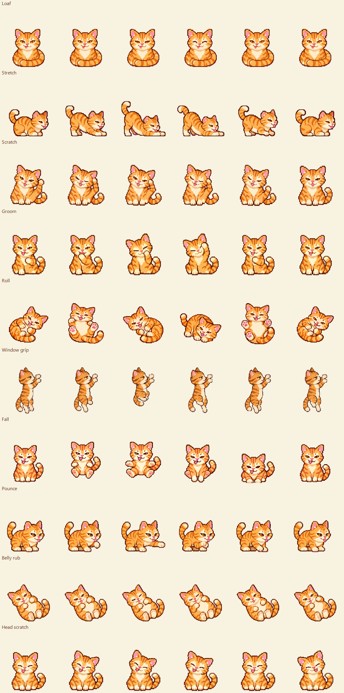

# Bob The Cat

A small ginger pixel cat that lives on your Windows desktop. Bob has his own routine: loafing, stretching, scratching, grooming, rolling, hopping, exploring, naps, and occasional zoomies. He can perch on windows, hang from an edge, fall and land, bat a ball of yarn, and chase a laser dot.



## What this project does

Bob is a native desktop companion. His behavior engine combines autonomous activity planning with cursor petting, dragging, window perching, and short toy sessions. Tray controls let you choose a quiet routine, pause animation, mute sounds, or make the cat click-through. Everything runs locally without an account or network service.

## Technology stack

| Technology | Responsibility |
| --- | --- |
| C# | Behavior engine, application host, and deterministic tests |
| .NET Framework 4.8 / WinForms | Windows application lifecycle, tray menu, timers, and preferences |
| Win32 interop | Transparent layered windows, window geometry, and click-through overlays |
| System.Drawing | Sprite extraction and nearest-neighbor rendering |
| XML serialization | Local user preferences |
| Embedded PNG, ICO, and WAV assets | Offline visuals and sound playback |
| PowerShell | Build, test, and portable packaging scripts |
| GitHub Actions | Windows CI build, deterministic checks, and ZIP artifacts |

There are no NuGet dependencies. Python and FFmpeg are optional tools for regenerating audio, not runtime requirements.

## Guides

- [Architecture and source ownership](docs/architecture.md)
- [Development, testing, and packaging](docs/development.md)
- [Artwork pipeline and attribution](docs/artwork.md)
- [Contributing](CONTRIBUTING.md)
- [Changelog](CHANGELOG.md)

The companion portfolio landing page is maintained in [Ry0x7.github.io](https://Ry0x7.github.io). It displays original sprites as a browser preview; desktop behavior requires this Windows application.

## Run Bob

Extract the portable archive and double-click **Bob The Cat.exe**. Keep **Bob The Cat.exe.config** beside it. Windows 10/11 with .NET Framework 4.8 is the supported target. There is no installer or account, and Bob does not add himself to startup.

Right-click Bob or his notification-area cat icon for the menu. Windows may tuck the icon inside the hidden-icons arrow.

| Interaction | What Bob does |
| --- | --- |
| Single click | Waves and plays one of four meows, avoiding consecutive repeats |
| Hover up/down over his head or belly | A few gentle vertical strokes trigger a head scratch or belly rub; no clicking needed |
| Double click | Jumps and chirps |
| Drag | Moves to your chosen spot, then rests briefly |
| Move your cursor nearby | Looks at it and may follow for up to three seconds, with an eighteen-second cooldown |
| Leave the keyboard/mouse idle | Naps after the chosen inactivity delay |
| **Cat actions** | Trigger loaf, stretch, scratch, groom, roll, hop, run, grab a window, or let go/fall |
| **Toys** | Spawn yarn, spawn a laser dot, or put toys away |

The laser moves itself by default. **Toys > Laser follows my cursor** lets you guide it. Toys are temporary and disappear when play ends or you interrupt it.

The added actions and yarn use reference-based generated pixel artwork. Frames retain their native resolution, share one scale per action, and render with nearest-neighbor sampling. See [artwork notes](docs/artwork.md).

## Controls

**Scratch Bob's head** and **Belly rub** are direct tray shortcuts. **Pet with cursor hover** toggles gesture petting. Move up/down a few times over visible fur within about two seconds; Bob reacts with relaxed eyes, a happy pose, and a meow. Petting has a short cooldown to keep sound from repeating too quickly.

- **Autonomous cat life** is the default. **Follow my cursor** and **Stay here** are also available.
- **Notice my nearby cursor** enables brief curiosity during a stroll or rest. Turning it off makes Bob's autonomous routine independent of the cursor.
- **Energetic play** allows autonomous zoomies, toy chases, hops, and window grabs. Turn it off for a calmer routine; you can still request actions yourself.
- **Allow toys** enables yarn and laser play. **Put toys away** ends the current toy session.
- **Play around open windows** enables window visits and grabs. A grip requires room above the window's top edge. Maximized windows use a lower-corner perch instead. A lost or maximized window makes a hanging Bob let go and fall.
- **Sound effects** toggles four quiet real cat meows and a retro chirp. There is no purr. Autonomous sounds have a cooldown.
- **Pause** freezes movement and animation, including toys. **Take a nap** stays asleep until you wake or click him.
- **Let clicks pass through Bob** makes the cat ignore clicks. His tray menu remains available. Toys and transparent space always pass clicks through.
- **Size**, **Nap after inactivity**, **Bring Bob here**, and **Quit Bob** are in the tray menu.

Actions stay within Bob's current monitor's working area. Bob uses window geometry to position himself; he does not modify, close, or move your windows. Click-through toys use their own small transparent windows.

Preferences are saved in `%LOCALAPPDATA%\BobDesktopPet\settings.xml`; startup/runtime errors go to `errors.log` beside them. Earlier desktop-pet preferences are imported when no Bob settings exist. The application runs offline and does not record window contents.

## Build

From the repository folder in Windows PowerShell:

```powershell
powershell -NoProfile -ExecutionPolicy Bypass -File .\build.ps1
```

The build uses the .NET Framework compiler installed with Windows, compiles the C# source, and embeds all sprites, the icon, and WAV effects. No NuGet packages or .NET SDK are required. The executable is written to the repository root. The bundled media already exists; FFmpeg and Python are only needed if you choose to regenerate audio.

## Test and package

```powershell
.\scripts\test.ps1
.\scripts\test.ps1 -Live -SkipBuild
.\scripts\package.ps1 -SkipBuild
```

The default tests are deterministic and silent. They check movement, sleep, negative monitor coordinates, autonomous variety, cursor curiosity and cooldown, new action completion, yarn batting, toy cleanup, window loss and landing, all action frames, meow variation, sound muting, head/belly hover strokes, and rejection of transparent-space/horizontal gestures.

`-Live` opens a temporary cat and test window for about ten seconds, exercises the real layered-window renderer and tray commands, verifies toy click-through/no-activation, and then closes them. Run it on an interactive Windows desktop. The GitHub workflow runs the default tests and packages a portable ZIP; it does not require a logged-in desktop session. Check the repository's Actions tab for the status of a particular CI run.

`package.ps1` writes `dist/Bob The Cat.zip`. Publish that ZIP as a GitHub release attachment. The source package contains a workflow, issue templates, contribution notes, and license/asset credits.

## Source map

| File | Purpose |
| --- | --- |
| `source/CatBrain.cs` | Deterministic activity planning, motion, cursor curiosity, window interactions, and toy physics |
| `source/Bob.cs` | Preferences, WinForms host, native window rendering, tray controls, sound playback, tests, and previews |
| `source/ExtraArt.cs` | Native generated sprite extraction and precise laser target |
| `source/HoverPetting.cs` | Vertical stroke detection, head/belly targeting, and petting cooldown |
| `source/ToyOverlay.cs` | Tiny click-through toy window and native resource cleanup |
| `source/AssemblyInfo.cs` | Application identity and version |
| `source/build.ps1` | Dependency-free Windows build |

## Credits and license

MIT for project code and original assets; CC0 for the meow recordings. See [LICENSE](LICENSE), [CREDITS.md](CREDITS.md), and [AUDIO_CREDITS.md](AUDIO_CREDITS.md).

Implementation references: [Windows layered rendering](https://learn.microsoft.com/en-us/windows/win32/api/winuser/nf-winuser-updatelayeredwindow), [WinForms notification icon](https://learn.microsoft.com/en-us/dotnet/desktop/winforms/controls/notifyicon-component-overview-windows-forms), [window enumeration](https://learn.microsoft.com/en-us/windows/win32/api/winuser/nf-winuser-enumwindows), [GitHub checkout](https://github.com/actions/checkout), and [GitHub artifact upload](https://github.com/actions/upload-artifact).
